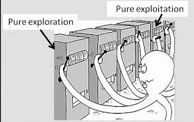

# A-Btesting_and_multi-armed_bandit_analysis
*Final project of Experiment Design, USF MSDS program*

# Description

The datasets are sales data and game user data.

This project includes A/B testing analysis implementation and multi-armed bandit strategies implementation.

       

# A/B Testing

1. Test whether the average purchase price is higher among customers in condition A than customers in condition B
- A/A testing
- Hypothesis testing
- Sample size calculation

2. Test the relationship between 3 different versions of in-game "boosters" and the length of time a user plays the game
- Pairwise t-test
- Bonferroni correction

3. Test which of five online banner ads is related to the largest click-through-rate
- Pairwise z-test

# Multi-armed Bandit Strategies Implementation

- ε-greedy procedure
- Upper confidence bound procedure. Include an input for whether or not the metric of interest is a mean or proportion
- Softmax procedure for proportions
